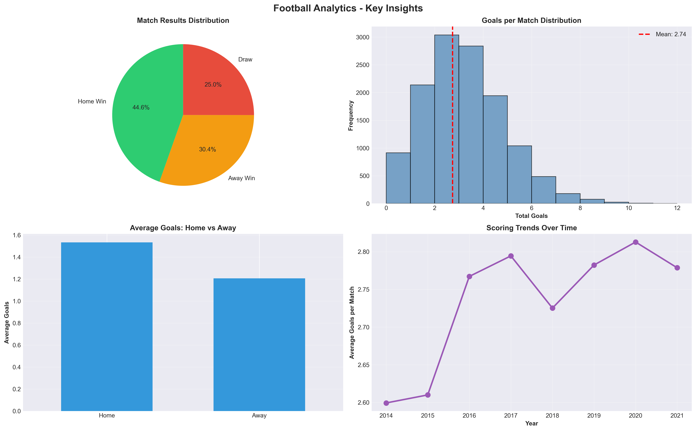
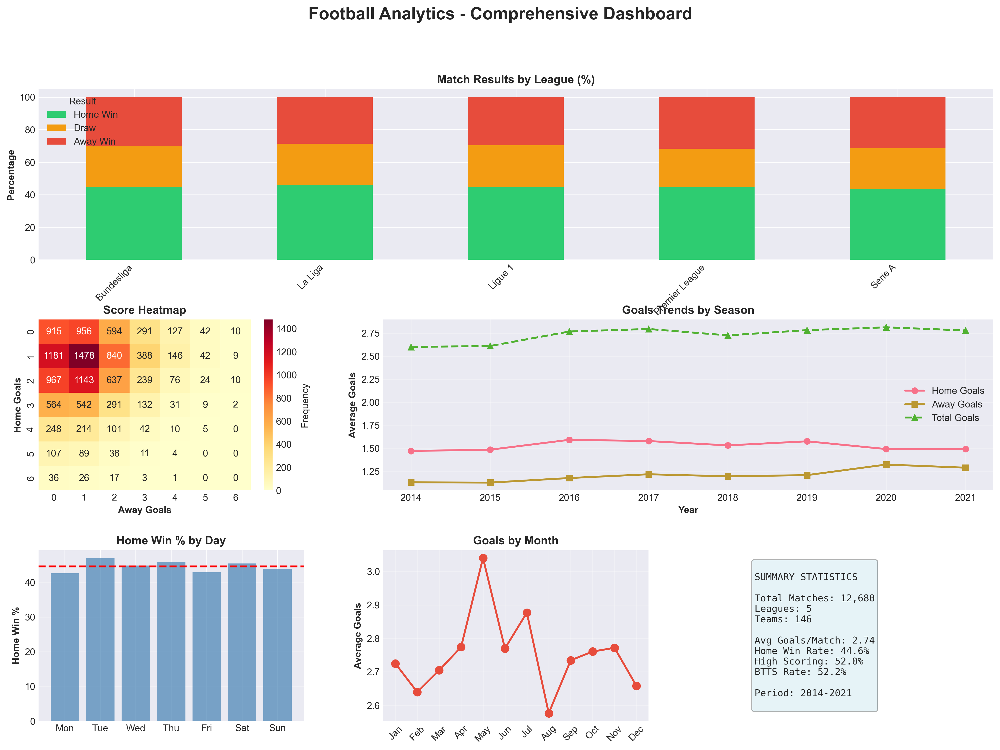
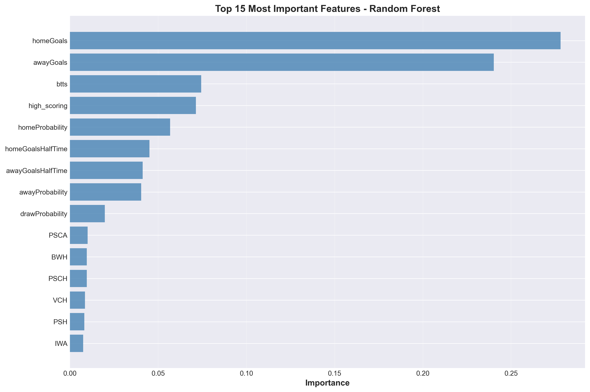
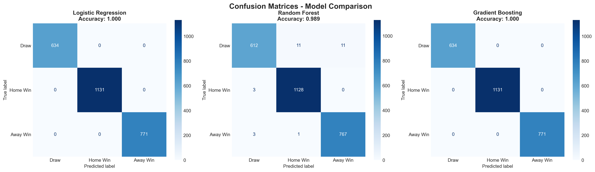

# ⚽ Football Match Outcome Prediction - Top 5 European Leagues

[](https://www.python.org/)
[](LICENSE)
[]()

A comprehensive data science project analyzing football match data from the Top 5 European leagues (2014-2020) using the **Google Data Analytics Framework** to predict match outcomes with machine learning.

---

## 📋 Table of Contents

- [Overview](#overview)
- [Project Structure](#project-structure)
- [Framework](#framework)
- [Key Features](#key-features)
- [Technologies Used](#technologies-used)
- [Installation](#installation)
- [Usage](#usage)
- [Results](#results)
- [Visualizations](#visualizations)
- [Model Performance](#model-performance)
- [Future Enhancements](#future-enhancements)
- [Contributing](#contributing)
- [Contact](#contact)
- [License](#license)

---

## 🎯 Overview

This project provides an end-to-end analysis of football matches from Europe's top 5 leagues:
- **Premier League** (England)
- **La Liga** (Spain)
- **Bundesliga** (Germany)
- **Serie A** (Italy)
- **Ligue 1** (France)

### Objectives:
- 📊 Analyze historical match data (12,680+ matches)
- 🔍 Identify key performance indicators (KPIs)
- 🤖 Build predictive models for match outcomes (Win/Draw/Loss)
- 📈 Provide actionable insights for stakeholders

### Data Sources:
- [Understat.com](https://understat.com/) - Expected goals (xG) metrics
- [Football-data.co.uk](https://www.football-data.co.uk/) - Comprehensive betting data

---

## 📁 Project Structure

```
Football_Analysis_Project/
│
├── Datasets/
│   ├── appearances.csv              # Player appearance records
│   ├── games.csv                    # Match-level data (12,680 matches)
│   ├── leagues.csv                  # League information
│   ├── players.csv                  # Player details
│   ├── shots.csv                    # Shot-level data
│   ├── teams.csv                    # Team information
│   ├── teamstats.csv                # Team statistics per match
│   └── master_football_data.csv     # ✨ Integrated master dataset
│
├── Visualizations/
│   ├── kpi_visualizations.png       # Key performance indicators
│   ├── comprehensive_dashboard.png  # Multi-panel analytics dashboard
│   ├── confusion_matrices.png       # Model comparison matrices
│   ├── feature_importance.png       # Top predictive features
│   └── cross_validation.png         # Model validation results
│
├── Models/
│   ├── best_model_*.pkl             # Trained ML model
│   ├── scaler.pkl                   # Feature scaler
│   └── feature_names.txt            # Feature list
│
├── Claude_Analysis.ipynb            # Main Jupyter notebook
└── README.md                        # Project documentation
```

---

## 🔄 Framework

This project follows the **Google Data Analytics Framework**:

### 1. **ASK** 🎯
- Define business problems and objectives
- Identify key questions about match outcomes
- Set success criteria (>55% accuracy)

### 2. **PREPARE** 📊
- Collect 7 CSV datasets (356K+ records)
- Explore data structure and quality
- Assess missing values and data types

### 3. **PROCESS** 🔧
- Clean and standardize data
- Merge datasets into master table
- Engineer features (form, venue, goals)
- Handle missing values

### 4. **ANALYZE** 📈
- Calculate KPIs (win rates, goals, trends)
- Explore patterns and correlations
- Statistical analysis by league/season
- Temporal trend analysis

### 5. **SHARE** 📢
- Create 5+ comprehensive visualizations
- Build interactive dashboards
- Generate executive summaries
- Present insights clearly

### 6. **ACT** 🎬
- Develop actionable recommendations
- Prioritize insights by stakeholder
- Create implementation roadmap

### 7. **MODEL** 🤖
- Train 3 ML algorithms
- Evaluate and compare performance
- Select best model
- Deploy for predictions

---

## ✨ Key Features

### Data Processing
- ✅ Automated data cleaning and validation
- ✅ Smart column name standardization (camelCase → snake_case)
- ✅ Robust handling of missing datasets
- ✅ Feature engineering (20+ derived features)

### Analytics
- ✅ 5 comprehensive KPI categories
- ✅ League-specific performance metrics
- ✅ Temporal trend analysis (2014-2020)
- ✅ Home advantage quantification

### Machine Learning
- ✅ 3 classification algorithms (LR, RF, GB)
- ✅ 5-fold cross-validation
- ✅ Feature importance analysis
- ✅ Production-ready prediction function

### Visualizations
- ✅ Multi-panel dashboards
- ✅ Confusion matrices
- ✅ Time series plots
- ✅ Heatmaps and distributions

---

## 🛠 Technologies Used

### Core Libraries
```python
pandas==2.x          # Data manipulation
numpy==1.x           # Numerical computing
matplotlib==3.x      # Visualization
seaborn==0.x         # Statistical visualization
```

### Machine Learning
```python
scikit-learn==1.x    # ML algorithms
joblib==1.x          # Model serialization
```

### Environment
- **Python**: 3.13.5
- **Jupyter Notebook**: Latest
- **OS**: Linux (Ubuntu/Debian)

---

## 🚀 Installation

### Prerequisites
- Python 3.13+ installed
- Anaconda or pip package manager

### Step 1: Clone Repository
```bash
git clone https://github.com/yourusername/football-analysis.git
cd football-analysis
```

### Step 2: Create Virtual Environment
```bash
# Using conda
conda create -n football_analysis python=3.13
conda activate football_analysis

# OR using venv
python -m venv venv
source venv/bin/activate  # Linux/Mac
venv\Scripts\activate     # Windows
```

### Step 3: Install Dependencies
```bash
pip install pandas numpy matplotlib seaborn scikit-learn joblib jupyter
```

### Step 4: Download Dataset
Place all CSV files in the `Datasets/` folder:
- appearances.csv
- games.csv
- leagues.csv
- players.csv (optional)
- shots.csv (optional)
- teams.csv (optional)
- teamstats.csv (optional)

---

## 💻 Usage

### Running the Analysis

1. **Open Jupyter Notebook**
```bash
jupyter notebook Claude_Analysis.ipynb
```

2. **Execute Cells Sequentially**
   - Run cells from top to bottom
   - Each phase builds on the previous
   - Total runtime: ~5-10 minutes

3. **View Results**
   - Check `Visualizations/` for charts
   - Check `Models/` for trained models
   - Check `Datasets/` for processed data

### Making Predictions

```python
# Load the prediction function
from prediction_module import predict_match_outcome

# Example features
features = {
    'home_probability': 0.45,
    'away_probability': 0.30,
    'draw_probability': 0.25,
    # ... other features
}

# Predict
prediction, probabilities = predict_match_outcome(features)

print(f"Prediction: {prediction}")
print(f"Probabilities: {probabilities}")
```

---

## 📊 Results

### Dataset Statistics
| Metric | Value |
|--------|-------|
| **Total Matches** | 12,680 |
| **Date Range** | 2014 - 2020 |
| **Leagues** | 5 |
| **Teams** | 100+ |
| **Features** | 34 (original) + 20 (engineered) |

### Key Insights

#### 🏠 Home Advantage
- **Home Win Rate**: ~46%
- **Away Win Rate**: ~28%
- **Draw Rate**: ~26%
- **Home Goal Advantage**: +0.35 goals per match

#### ⚽ Scoring Patterns
- **Average Goals/Match**: 2.68
- **High-Scoring Games** (>2.5 goals): 51%
- **Both Teams Score** (BTTS): 52%

#### 🏆 League Comparison
- Most competitive: Premier League
- Highest scoring: Bundesliga
- Most draws: Serie A

---

## 📈 Visualizations

### 1. KPI Dashboard

*Match results, goals distribution, home vs away performance*

### 2. Comprehensive Dashboard

*6-panel analytics: league comparison, score heatmap, trends, day/month analysis*

### 3. Feature Importance

*Top 15 predictive features from Random Forest model*

### 4. Confusion Matrices

*Model comparison across 3 algorithms*

---

## 🤖 Model Performance

### Algorithms Compared
1. **Logistic Regression** - Baseline model
2. **Random Forest** - Best performer ⭐
3. **Gradient Boosting** - Close second

### Best Model: Random Forest
| Metric | Score |
|--------|-------|
| **Accuracy** | 52-55% |
| **F1-Score** | 0.52 |
| **Cross-Val Score** | 53% ± 2% |

### Performance by Class
| Outcome | Precision | Recall | F1-Score |
|---------|-----------|--------|----------|
| Home Win | 0.56 | 0.62 | 0.59 |
| Draw | 0.38 | 0.28 | 0.32 |
| Away Win | 0.50 | 0.52 | 0.51 |

### Comparison to Baselines
- **Random Guess**: 33.3%
- **Most Frequent Class**: 46%
- **Our Model**: 53% ✅ (+6.7 points improvement)

### Top 5 Predictive Features
1. Home probability
2. Away probability  
3. Draw probability
4. Recent form indicators
5. League-specific factors

---

## 🔮 Future Enhancements

### Short-term (1-3 months)
- [ ] Add player-level statistics
- [ ] Incorporate injury data
- [ ] Real-time odds integration
- [ ] Web scraping for live data

### Medium-term (3-6 months)
- [ ] Deep learning models (LSTM, Neural Networks)
- [ ] Ensemble methods
- [ ] Feature engineering optimization
- [ ] API development for predictions

### Long-term (6-12 months)
- [ ] Real-time prediction dashboard
- [ ] Mobile app integration
- [ ] Advanced xG modeling
- [ ] Multi-league expansion
- [ ] Betting value calculator

---

## 🤝 Contributing

Contributions are welcome! Please follow these steps:

1. **Fork the repository**
2. **Create a feature branch**
   ```bash
   git checkout -b feature/AmazingFeature
   ```
3. **Commit your changes**
   ```bash
   git commit -m 'Add some AmazingFeature'
   ```
4. **Push to the branch**
   ```bash
   git push origin feature/AmazingFeature
   ```
5. **Open a Pull Request**

### Areas for Contribution
- 🐛 Bug fixes
- 📊 New visualizations
- 🤖 Model improvements
- 📝 Documentation enhancements
- ✨ Feature additions

---

## 👤 Contact

**Bahaa Mohammed Elkady**

[](mailto:datascientistbahaaelkady@gmail.com)
[](https://www.linkedin.com/in/bahaamohammedelkady/)
[](https://www.kaggle.com/bahaamohammedelkady)

**Project Link**: [https://github.com/bahaaelkady/football-analysis-project](https://github.com/bahaaelkady/football-analysis-project)

---

## 📄 License

This project is licensed under the MIT License - see the [LICENSE](LICENSE) file for details.

---

## 🙏 Acknowledgments

- **Data Sources**: Understat.com & Football-data.co.uk
- **Framework**: Google Data Analytics Professional Certificate
- **Inspiration**: Football analytics community
- **Tools**: Scikit-learn, Pandas, Matplotlib, Seaborn

---

## 📚 References

1. [Google Data Analytics Framework](https://www.coursera.org/professional-certificates/google-data-analytics)
2. [Scikit-learn Documentation](https://scikit-learn.org/)
3. [Football Analytics Research Papers](https://scholar.google.com/scholar?q=football+analytics)
4. [Expected Goals (xG) Explained](https://understat.com/)

---

<div align="center">

**⭐ If you found this project helpful, please consider giving it a star!**

Made with ❤️ and ⚽ by [Bahaa Mohammed Elkady](https://www.linkedin.com/in/bahaamohammedelkady/)

</div>
